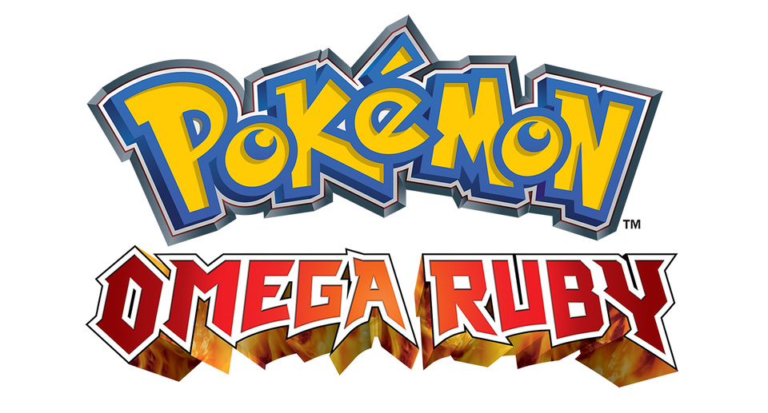

  

I really enjoyed this game. I love the reimagining of it, and the emphasis on the story. There are little "slice of life" moments with your parents and I think it's really sweet to show this in a game, it makes the world feel alive. The Delta episode was super cool, you go into space!

My aim for this game is to be a "completionist" game - I want to complete at least the Hoenn Pokedex for it, which is just seeing all Pokemon. I wil then try and get as many national pokedex pokemon as I can. 721 is quite a tall order! I expect I will transfer in tonnes of Pokemon from Platinum/Black/Black 2.

## Pokedex

- Hoenn Pokedex: 89/211
- National Pokedex: 97/732

## Champion team

Completed 27th September 2020

