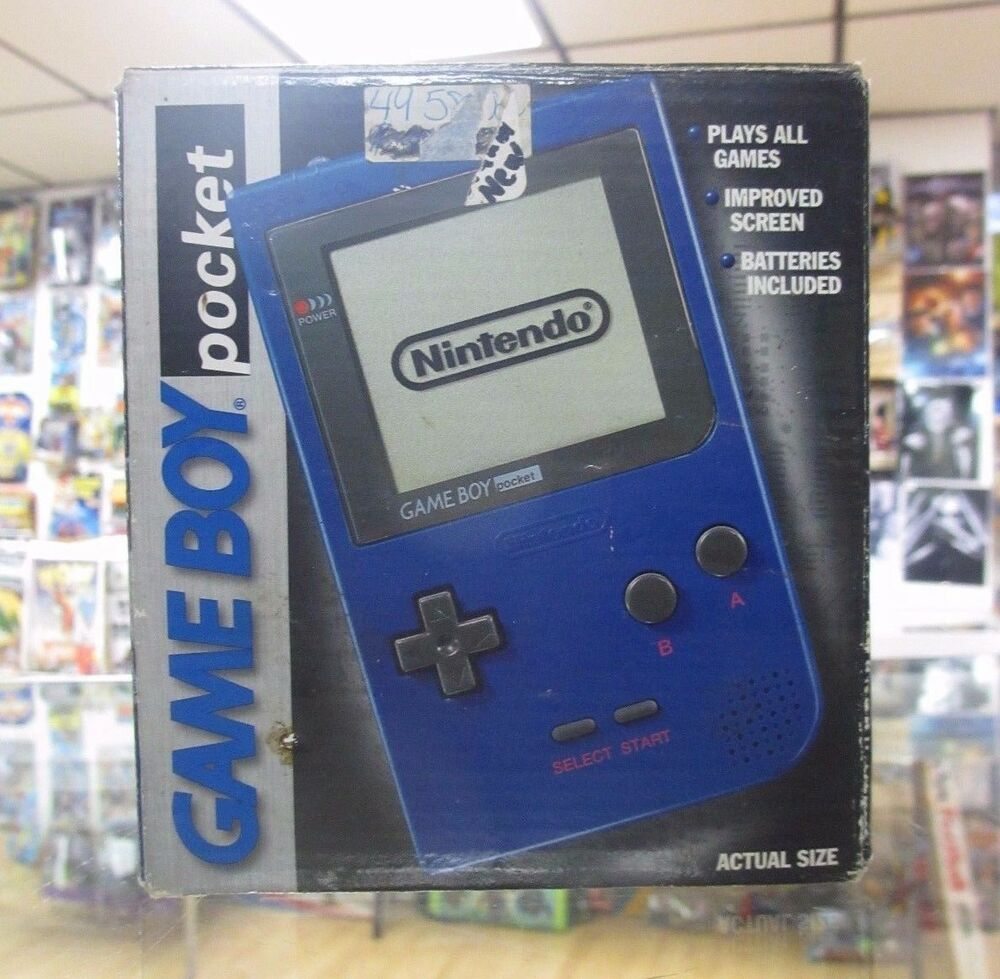
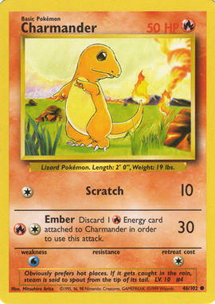

An archive of my Pokemon games, Pokemon caught, etc.

- [Where did I start?](#where-did-i-start)
- [Favourite Pokemon](#favourite-pokemon)
- [Products](#products)
  - [Games](#games)
  - [Consoles](#consoles)
- [General Pokemon statistics](#general-pokemon-statistics)
- [Pokemon Omega Ruby](#pokemon-omega-ruby)
  - [Champion team](#champion-team)
- [Pokemon TCG](#pokemon-tcg)
  - [2011-2013](#2011-2013)
    - [Tournaments](#tournaments)
      - [2012](#2012)
      - [2013](#2013)
      - [Play! Points](#play-points)
  - [2020](#2020)

## Where did I start?

I think I was nine, maybe ten years old. Perfect considering the main character of the game is around that age when they start their adventure.

By this point my parents had split up, so my Dad was picking me up for a weekend stay.
My birthday is September 13th, and I know that Pokemon Red/Blue was available October 5th 1999, so it must have been a few weeks after my birthday.
Dad had bought me a copy of Pokemon Blue and a blue [Gameboy pocket](https://en.wikipedia.org/wiki/Game_Boy#Game_Boy_Pocket). I think the Gameboy was secondhand, but the game was definitely new.

  

This wasn't my first exposure to Pokemon though. I was into video games, I owned a PlayStation with [A Bug's Life](https://en.wikipedia.org/wiki/A_Bug%27s_Life_(video_game)), that had come out in February 1999. So that means between February and October I had bought and read various magazines and I remember a Nintendo magazine giving away a free Pokemon card, a [Charmander base set 46](https://bulbapedia.bulbagarden.net/wiki/Charmander_(Base_Set_46)). I have an odd feeling every time I see this card. I distinctly remember reading the text over and over, and being curious about this word "Pokemon". I have searched high and low to find the exact magazine that I got this card in, and I can't find it.

It was in either 1998 or 1999, and it must have been a magazine for Nintendo or trading cards (I know TopDeck was a magazine for Wizards of the Coast back then), and I was into Magic: The Gathering just before I found out about Pokemon.

  

## Favourite Pokemon

Not an exhaustive list, the sprites are from my project; [The Pokemon API](https://pokeapi.co)

## Products

### Games

I currently own copies of the following:

- [Pokemon Platinum](https://bulbapedia.bulbagarden.net/wiki/Pok%C3%A9mon_Platinum_Version) (missing manual)
- [Pokemon SoulSilver](https://bulbapedia.bulbagarden.net/wiki/Pok%C3%A9mon_HeartGold_and_SoulSilver_Versions) (Boxed, with pokewalker)
- [Pokemon Black](https://bulbapedia.bulbagarden.net/wiki/Pok%C3%A9mon_Black_and_White_Versions)
- [Pokemon Black 2](https://bulbapedia.bulbagarden.net/wiki/Pok%C3%A9mon_Black_and_White_Versions_2)
- [Pokemon Y](https://bulbapedia.bulbagarden.net/wiki/Pok%C3%A9mon_X_and_Y)
- [Pokemon Sun](https://bulbapedia.bulbagarden.net/wiki/Pok%C3%A9mon_Sun_and_Moon)
- [Pokemon Sword](https://bulbapedia.bulbagarden.net/wiki/Pok%C3%A9mon_Sword_and_Shield)
- [Pokemon GO](https://bulbapedia.bulbagarden.net/wiki/Pok%C3%A9mon_GO)

### Consoles

- [New Nintendo 3DS XL](https://bulbapedia.bulbagarden.net/wiki/New_Nintendo_3DS_XL)
- [Nintendo Switch](https://bulbapedia.bulbagarden.net/wiki/Nintendo_Switch) (Animal Crossing edition)
- [Pokewalker](https://bulbapedia.bulbagarden.net/wiki/Pok%C3%A9walker)
- iPhone 10

## General Pokemon statistics

- Total unique across all games: 57
- Total Shinies: 4

## Pokemon Omega Ruby

- Pokedex: 49

### Champion team

Completed 27th September 2020

## Pokemon TCG

### 2011-2013

My first foray into the world of competitive TCG was during the Black & White era. EX cards were just coming out in Noble Victories, MewTwo EX was dominating all the tournaments. My most sort-after card during this time was a [Darkrai EX full art](https://limitlesstcg.com/cards/dex/107/), which I managed to pull from a random pack! I also remember having a [Chandelure secret rare](https://limitlesstcg.com/cards/nxd/101/).

Unfortunately, I was leaving university and became ashamed of my Pokemon hobby, so I threw all my cards in the rubbish. It was the most stupid mistake of my life (probably).

I was just starting to get good, as well (as evidenced with my win record below)

#### Tournaments

##### 2012

- 10th March | Regional Championship - Exeter. **23** out of 28
- 12th May | Dark Explorers Release Event **4** out of 8.
- 11th August | Dragons Exalted Release Event **1** out of 8 🥇
- 15th September | Pokemon Standard **9** out of 13
- 13th October | Battle Roads **3** out of 16 🥉
- 28th October | Battle Roads Exeter **9** out of 17
- 10th November | Boundaries Crossed Sneak Peek **2** out of 7 🥈

##### 2013

- 30th March 2013 | Antics table Top Day **8** out of 8 🤡

##### Play! Points

- Ranked 2440 at the end of 2013 with 22 Play! Points.

### 2020

I've picked up Pokemon TCG again after a very long hiatus. Now that I live in New Zealand, my goal is to place reasonably well (top 100) of the Oceania circuit.

- 27th September | Local league **7** out of 11
